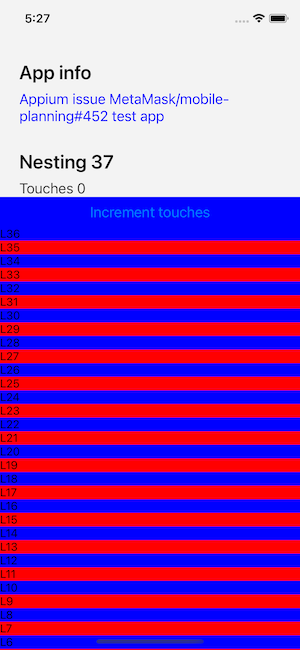

# Appium Wdio iOS nesting test

Testing depth of view nesting in iOS react-native app when trying to access elements using Wdio and Appium

## Setup

1. Clone this repo
1. run `yarn install`
1. Make sure you have an `iPhone 11 Pro` iOS simulator running (note this could be changed to use a physical devices)
1. run `yarn build:ios` to build the app to be sent to appium
1. run `yarn start` to have the packager started
1. run `yarn wdio:ios` to run the appium / wdio tests on iOS simulator

See demo: [Appium.wdio.iOS.test.mp4](https://github.com/NicolasMassart/appium-wdio-ios-nesting-test/releases/download/1/Appium.wdio.iOS.test.mp4)

## Results

### Passing test (`nestingDepth = 36`)

```
yarn run wdio:ios
yarn run v1.22.19
$ wdio wdio/config/wdio.ios.app.conf.ts

Execution of 1 workers started at 2023-02-06T16:13:39.774Z

2023-02-06T16:13:39.796Z DEBUG @wdio/utils:initialiseServices: initialise service "appium" as NPM package
2023-02-06T16:13:39.818Z INFO @wdio/cli:launcher: Run onPrepare hook
2023-02-06T16:13:39.820Z DEBUG @wdio/appium-service: Will spawn Appium process: appium --base-path / --relaxed-security --address localhost --log ./appium.log
2023-02-06T16:13:45.672Z DEBUG @wdio/appium-service: Appium started with ID: 72602
2023-02-06T16:13:45.673Z DEBUG @wdio/cli:utils: Finished to run "onPrepare" hook in 5854ms
2023-02-06T16:13:45.674Z INFO @wdio/cli:launcher: Run onWorkerStart hook
2023-02-06T16:13:45.674Z DEBUG @wdio/cli:utils: Finished to run "onWorkerStart" hook in 0ms
2023-02-06T16:13:45.675Z INFO @wdio/local-runner: Start worker 0-0 with arg: wdio/config/wdio.ios.app.conf.ts
2023-02-06T16:13:45.680Z DEBUG @wdio/local-runner: Send command run to worker with cid "0-0"
[0-0] 2023-02-06T16:13:46.892Z INFO @wdio/local-runner: Run worker command: run
[0-0] 2023-02-06T16:13:47.272Z DEBUG @wdio/runner: init remote session
[0-0] 2023-02-06T16:13:47.284Z DEBUG @wdio/utils:initialiseServices: initialise service "appium" as NPM package
[0-0] RUNNING in iOS - file:///wdio/features/increment.feature
[0-0] 2023-02-06T16:13:48.308Z DEBUG @wdio/runner: init remote session
[0-0] 2023-02-06T16:13:48.311Z INFO webdriver: Initiate new session using the WebDriver protocol
[0-0] 2023-02-06T16:13:48.476Z INFO webdriver: [POST] http://127.0.0.1:4723/session
[0-0] 2023-02-06T16:13:48.477Z INFO webdriver: DATA {
[0-0]   capabilities: {
[0-0]     alwaysMatch: {
[0-0]       platformName: 'iOS',
[0-0]       'appium:deviceName': 'iPhone 11 Pro',
[0-0]       'appium:platformVersion': '16.2',
[0-0]       'appium:orientation': 'PORTRAIT',
[0-0]       'appium:automationName': 'XCUITest',
[0-0]       'appium:app': '/Users/nicolas/Develop/Metamask/experiments/appium/ios/build/Build/Products/Debug-iphonesimulator/appium.app',
[0-0]       'appium:newCommandTimeout': 240,
[0-0]       'appium:printPageSourceOnFindFailure': true
[0-0]     },
[0-0]     firstMatch: [ {} ]
[0-0]   },
[0-0]   desiredCapabilities: {
[0-0]     platformName: 'iOS',
[0-0]     'appium:deviceName': 'iPhone 11 Pro',
[0-0]     'appium:platformVersion': '16.2',
[0-0]     'appium:orientation': 'PORTRAIT',
[0-0]     'appium:automationName': 'XCUITest',
[0-0]     'appium:app': '/Users/nicolas/Develop/Metamask/experiments/appium/ios/build/Build/Products/Debug-iphonesimulator/appium.app',
[0-0]     'appium:newCommandTimeout': 240,
[0-0]     'appium:printPageSourceOnFindFailure': true
[0-0]   }
[0-0] }
[0-0] 2023-02-06T16:14:00.685Z INFO webdriver: COMMAND findElement("-ios predicate string", "type == 'XCUIElementTypeButton' && name CONTAINS 'increment-touches'")
[0-0] 2023-02-06T16:14:00.687Z INFO webdriver: [POST] http://127.0.0.1:4723/session/799d7f80-6d24-4595-801c-752464dd2053/element
[0-0] 2023-02-06T16:14:00.688Z INFO webdriver: DATA {
[0-0]   using: '-ios predicate string',
[0-0]   value: "type == 'XCUIElementTypeButton' && name CONTAINS 'increment-touches'"
[0-0] }
[0-0] 2023-02-06T16:14:01.181Z INFO webdriver: RESULT {
[0-0]   'element-6066-11e4-a52e-4f735466cecf': '5F000000-0000-0000-EF1B-010000000000',
[0-0]   ELEMENT: '5F000000-0000-0000-EF1B-010000000000'
[0-0] }
[0-0] 2023-02-06T16:14:01.198Z INFO webdriver: COMMAND isElementDisplayed("5F000000-0000-0000-EF1B-010000000000")
[0-0] 2023-02-06T16:14:01.199Z INFO webdriver: [GET] http://127.0.0.1:4723/session/799d7f80-6d24-4595-801c-752464dd2053/element/5F000000-0000-0000-EF1B-010000000000/displayed
[0-0] 2023-02-06T16:14:01.617Z INFO webdriver: RESULT true
[0-0] 2023-02-06T16:14:01.620Z INFO webdriver: COMMAND findElement("xpath", "//XCUIElementTypeButton[@name="increment-touches"]")
[0-0] 2023-02-06T16:14:01.621Z INFO webdriver: [POST] http://127.0.0.1:4723/session/799d7f80-6d24-4595-801c-752464dd2053/element
[0-0] 2023-02-06T16:14:01.621Z INFO webdriver: DATA {
[0-0]   using: 'xpath',
[0-0]   value: '//XCUIElementTypeButton[@name="increment-touches"]'
[0-0] }
[0-0] 2023-02-06T16:14:02.848Z INFO webdriver: RESULT {
[0-0]   'element-6066-11e4-a52e-4f735466cecf': '5F000000-0000-0000-EF1B-010000000000',
[0-0]   ELEMENT: '5F000000-0000-0000-EF1B-010000000000'
[0-0] }
[0-0] 2023-02-06T16:14:02.852Z INFO webdriver: COMMAND isElementDisplayed("5F000000-0000-0000-EF1B-010000000000")
[0-0] 2023-02-06T16:14:02.852Z INFO webdriver: [GET] http://127.0.0.1:4723/session/799d7f80-6d24-4595-801c-752464dd2053/element/5F000000-0000-0000-EF1B-010000000000/displayed
[0-0] 2023-02-06T16:14:02.981Z INFO webdriver: RESULT true
[0-0] 2023-02-06T16:14:02.982Z INFO webdriver: COMMAND findElement("accessibility id", "increment-touches")
[0-0] 2023-02-06T16:14:02.983Z INFO webdriver: [POST] http://127.0.0.1:4723/session/799d7f80-6d24-4595-801c-752464dd2053/element
[0-0] 2023-02-06T16:14:02.983Z INFO webdriver: DATA { using: 'accessibility id', value: 'increment-touches' }
[0-0] 2023-02-06T16:14:03.266Z INFO webdriver: RESULT {
[0-0]   'element-6066-11e4-a52e-4f735466cecf': '5F000000-0000-0000-EF1B-010000000000',
[0-0]   ELEMENT: '5F000000-0000-0000-EF1B-010000000000'
[0-0] }
[0-0] 2023-02-06T16:14:03.269Z INFO webdriver: COMMAND isElementDisplayed("5F000000-0000-0000-EF1B-010000000000")
[0-0] 2023-02-06T16:14:03.269Z INFO webdriver: [GET] http://127.0.0.1:4723/session/799d7f80-6d24-4595-801c-752464dd2053/element/5F000000-0000-0000-EF1B-010000000000/displayed
[0-0] 2023-02-06T16:14:03.424Z INFO webdriver: RESULT true
[0-0] 2023-02-06T16:14:03.426Z INFO webdriver: COMMAND findElement("accessibility id", "Touches 0")
[0-0] 2023-02-06T16:14:03.426Z INFO webdriver: [POST] http://127.0.0.1:4723/session/799d7f80-6d24-4595-801c-752464dd2053/element
[0-0] 2023-02-06T16:14:03.426Z INFO webdriver: DATA { using: 'accessibility id', value: 'Touches 0' }
[0-0] 2023-02-06T16:14:03.742Z INFO webdriver: RESULT {
[0-0]   'element-6066-11e4-a52e-4f735466cecf': '12000000-0000-0000-EF1B-010000000000',
[0-0]   ELEMENT: '12000000-0000-0000-EF1B-010000000000'
[0-0] }
[0-0] 2023-02-06T16:14:03.746Z INFO webdriver: COMMAND isElementDisplayed("12000000-0000-0000-EF1B-010000000000")
[0-0] 2023-02-06T16:14:03.747Z INFO webdriver: [GET] http://127.0.0.1:4723/session/799d7f80-6d24-4595-801c-752464dd2053/element/12000000-0000-0000-EF1B-010000000000/displayed
[0-0] 2023-02-06T16:14:03.875Z INFO webdriver: RESULT true
[0-0] 2023-02-06T16:14:03.876Z INFO webdriver: COMMAND findElement("accessibility id", "increment-touches")
[0-0] 2023-02-06T16:14:03.877Z INFO webdriver: [POST] http://127.0.0.1:4723/session/799d7f80-6d24-4595-801c-752464dd2053/element
[0-0] 2023-02-06T16:14:03.877Z INFO webdriver: DATA { using: 'accessibility id', value: 'increment-touches' }
[0-0] 2023-02-06T16:14:04.149Z INFO webdriver: RESULT {
[0-0]   'element-6066-11e4-a52e-4f735466cecf': '5F000000-0000-0000-EF1B-010000000000',
[0-0]   ELEMENT: '5F000000-0000-0000-EF1B-010000000000'
[0-0] }
[0-0] 2023-02-06T16:14:04.153Z INFO webdriver: COMMAND touchPerform(<object>)
[0-0] 2023-02-06T16:14:04.154Z INFO webdriver: [POST] http://127.0.0.1:4723/session/799d7f80-6d24-4595-801c-752464dd2053/touch/perform
[0-0] 2023-02-06T16:14:04.154Z INFO webdriver: DATA { actions: [ { action: 'tap', options: [Object] } ] }
[0-0] 2023-02-06T16:14:04.722Z INFO webdriver: RESULT null
[0-0] 2023-02-06T16:14:09.725Z INFO webdriver: COMMAND findElement("accessibility id", "Touches 1")
[0-0] 2023-02-06T16:14:09.726Z INFO webdriver: [POST] http://127.0.0.1:4723/session/799d7f80-6d24-4595-801c-752464dd2053/element
[0-0] 2023-02-06T16:14:09.726Z INFO webdriver: DATA { using: 'accessibility id', value: 'Touches 1' }
[0-0] 2023-02-06T16:14:10.076Z INFO webdriver: RESULT {
[0-0]   'element-6066-11e4-a52e-4f735466cecf': '12000000-0000-0000-EF1B-010000000000',
[0-0]   ELEMENT: '12000000-0000-0000-EF1B-010000000000'
[0-0] }
[0-0] 2023-02-06T16:14:10.085Z INFO webdriver: COMMAND isElementDisplayed("12000000-0000-0000-EF1B-010000000000")
[0-0] 2023-02-06T16:14:10.086Z INFO webdriver: [GET] http://127.0.0.1:4723/session/799d7f80-6d24-4595-801c-752464dd2053/element/12000000-0000-0000-EF1B-010000000000/displayed
[0-0] 2023-02-06T16:14:10.266Z INFO webdriver: RESULT true
[0-0] 2023-02-06T16:14:10.270Z INFO webdriver: COMMAND deleteSession()
[0-0] 2023-02-06T16:14:10.270Z INFO webdriver: [DELETE] http://127.0.0.1:4723/session/799d7f80-6d24-4595-801c-752464dd2053
[0-0] 2023-02-06T16:14:11.351Z INFO webdriver: RESULT null
2023-02-06T16:14:11.489Z DEBUG @wdio/local-runner: Runner 0-0 finished with exit code 0
[0-0] PASSED in iOS - file:///wdio/features/increment.feature
2023-02-06T16:14:11.490Z INFO @wdio/cli:launcher: Run onWorkerEnd hook
2023-02-06T16:14:11.491Z DEBUG @wdio/cli:utils: Finished to run "onWorkerEnd" hook in 0ms
2023-02-06T16:14:11.491Z INFO @wdio/cli:launcher: Run onComplete hook
2023-02-06T16:14:11.491Z DEBUG @wdio/appium-service: Appium (pid: 72602) killed
2023-02-06T16:14:11.491Z DEBUG @wdio/cli:utils: Finished to run "onComplete" hook in 0ms

 "spec" Reporter:
------------------------------------------------------------------
[iPhone 11 Pro iOS 16.2 #0-0] Running: iPhone 11 Pro on iOS 16.2 executing /Users/nicolas/Develop/Metamask/experiments/appium/ios/build/Build/Products/Debug-iphonesimulator/appium.app
[iPhone 11 Pro iOS 16.2 #0-0] Session ID: 799d7f80-6d24-4595-801c-752464dd2053
[iPhone 11 Pro iOS 16.2 #0-0]
[iPhone 11 Pro iOS 16.2 #0-0] » /wdio/features/increment.feature
[iPhone 11 Pro iOS 16.2 #0-0] Sample feature file to illustrate app and browser tests
[iPhone 11 Pro iOS 16.2 #0-0] Launch app
[iPhone 11 Pro iOS 16.2 #0-0]    ✓ Given I launched the app
[iPhone 11 Pro iOS 16.2 #0-0]    ✓ And I see the increment button using ios-chain-query
[iPhone 11 Pro iOS 16.2 #0-0]    ✓ And I see the increment button using ios-xpath
[iPhone 11 Pro iOS 16.2 #0-0]    ✓ And I see the increment button using wdio-selector
[iPhone 11 Pro iOS 16.2 #0-0]    ✓ And I see the touches 0
[iPhone 11 Pro iOS 16.2 #0-0]    ✓ When I touch the increment button
[iPhone 11 Pro iOS 16.2 #0-0]    ✓ Then touch number is 1
[iPhone 11 Pro iOS 16.2 #0-0]
[iPhone 11 Pro iOS 16.2 #0-0] 7 passing (11.4s)


Spec Files:      1 passed, 1 total (100% completed) in 00:00:31 

2023-02-06T16:14:11.492Z INFO @wdio/local-runner: Shutting down spawned worker
2023-02-06T16:14:11.744Z INFO @wdio/local-runner: Waiting for 0 to shut down gracefully
2023-02-06T16:14:11.745Z INFO @wdio/local-runner: shutting down
✨  Done in 35.62s.

Process finished with exit code 0
```

### Failing test

try to update nestingDepth to 37 in `App.tsx` line 23.


```
yarn run wdio:ios
yarn run v1.22.19
$ wdio wdio/config/wdio.ios.app.conf.ts

Execution of 1 workers started at 2023-02-06T16:22:57.817Z

2023-02-06T16:22:57.847Z DEBUG @wdio/utils:initialiseServices: initialise service "appium" as NPM package
2023-02-06T16:22:57.874Z INFO @wdio/cli:launcher: Run onPrepare hook
2023-02-06T16:22:57.876Z DEBUG @wdio/appium-service: Will spawn Appium process: appium --base-path / --relaxed-security --address localhost --log ./appium.log
2023-02-06T16:23:03.945Z DEBUG @wdio/appium-service: Appium started with ID: 73766
2023-02-06T16:23:03.946Z DEBUG @wdio/cli:utils: Finished to run "onPrepare" hook in 6071ms
2023-02-06T16:23:03.949Z INFO @wdio/cli:launcher: Run onWorkerStart hook
2023-02-06T16:23:03.949Z DEBUG @wdio/cli:utils: Finished to run "onWorkerStart" hook in 0ms
2023-02-06T16:23:03.950Z INFO @wdio/local-runner: Start worker 0-0 with arg: wdio/config/wdio.ios.app.conf.ts
2023-02-06T16:23:03.960Z DEBUG @wdio/local-runner: Send command run to worker with cid "0-0"
[0-0] 2023-02-06T16:23:05.087Z INFO @wdio/local-runner: Run worker command: run
[0-0] 2023-02-06T16:23:05.430Z DEBUG @wdio/runner: init remote session
[0-0] 2023-02-06T16:23:05.437Z DEBUG @wdio/utils:initialiseServices: initialise service "appium" as NPM package
[0-0] RUNNING in iOS - file:///wdio/features/increment.feature
[0-0] 2023-02-06T16:23:06.336Z DEBUG @wdio/runner: init remote session
[0-0] 2023-02-06T16:23:06.338Z INFO webdriver: Initiate new session using the WebDriver protocol
[0-0] 2023-02-06T16:23:06.520Z INFO webdriver: [POST] http://127.0.0.1:4723/session
[0-0] 2023-02-06T16:23:06.520Z INFO webdriver: DATA {
[0-0]   capabilities: {
[0-0]     alwaysMatch: {
[0-0]       platformName: 'iOS',
[0-0]       'appium:deviceName': 'iPhone 11 Pro',
[0-0]       'appium:platformVersion': '16.2',
[0-0]       'appium:orientation': 'PORTRAIT',
[0-0]       'appium:automationName': 'XCUITest',
[0-0]       'appium:app': '/Users/nicolas/Develop/Metamask/experiments/appium/ios/build/Build/Products/Debug-iphonesimulator/appium.app',
[0-0]       'appium:newCommandTimeout': 240,
[0-0]       'appium:printPageSourceOnFindFailure': true
[0-0]     },
[0-0]     firstMatch: [ {} ]
[0-0]   },
[0-0]   desiredCapabilities: {
[0-0]     platformName: 'iOS',
[0-0]     'appium:deviceName': 'iPhone 11 Pro',
[0-0]     'appium:platformVersion': '16.2',
[0-0]     'appium:orientation': 'PORTRAIT',
[0-0]     'appium:automationName': 'XCUITest',
[0-0]     'appium:app': '/Users/nicolas/Develop/Metamask/experiments/appium/ios/build/Build/Products/Debug-iphonesimulator/appium.app',
[0-0]     'appium:newCommandTimeout': 240,
[0-0]     'appium:printPageSourceOnFindFailure': true
[0-0]   }
[0-0] }
[0-0] 2023-02-06T16:23:17.798Z INFO webdriver: COMMAND findElement("-ios predicate string", "type == 'XCUIElementTypeButton' && name CONTAINS 'increment-touches'")
[0-0] 2023-02-06T16:23:17.799Z INFO webdriver: [POST] http://127.0.0.1:4723/session/f5748667-d6a7-4ea4-b43e-cc7af3774d32/element
[0-0] 2023-02-06T16:23:17.800Z INFO webdriver: DATA {
[0-0]   using: '-ios predicate string',
[0-0]   value: "type == 'XCUIElementTypeButton' && name CONTAINS 'increment-touches'"
[0-0] }
[0-0] 2023-02-06T16:23:21.477Z INFO webdriver: RESULT {
[0-0]   error: 'no such element',
[0-0]   message: 'An element could not be located on the page using the given search parameters.',
[0-0]   stacktrace: 'NoSuchElementError: An element could not be located on the page using the given search parameters.\n' +
[0-0]     '    at XCUITestDriver.doNativeFind (/Users/nicolas/Develop/Metamask/experiments/appium/node_modules/appium-xcuitest-driver/lib/commands/find.js:129:11)\n' +
[0-0]     '    at runMicrotasks (<anonymous>)\n' +
[0-0]     '    at processTicksAndRejections (node:internal/process/task_queues:96:5)\n' +
[0-0]     '    at async XCUITestDriver.findNativeElementOrElements (/Users/nicolas/Develop/Metamask/experiments/appium/node_modules/appium-xcuitest-driver/lib/commands/find.js:89:10)\n' +
[0-0]     '    at async XCUITestDriver.findElOrEls (/Users/nicolas/Develop/Metamask/experiments/appium/node_modules/appium-xcuitest-driver/lib/commands/find.js:22:12)\n' +
[0-0]     '    at async XCUITestDriver.findElOrElsWithProcessing (/Users/nicolas/Develop/Metamask/experiments/appium/node_modules/@appium/base-driver/lib/basedriver/commands/find.js:81:16)\n' +
[0-0]     '    at async XCUITestDriver.findElement (/Users/nicolas/Develop/Metamask/experiments/appium/node_modules/@appium/base-driver/lib/basedriver/commands/find.js:21:14)'
[0-0] }
[0-0] 2023-02-06T16:23:21.488Z INFO webdriver: COMMAND findElement("-ios predicate string", "type == 'XCUIElementTypeButton' && name CONTAINS 'increment-touches'")
[0-0] 2023-02-06T16:23:21.488Z INFO webdriver: [POST] http://127.0.0.1:4723/session/f5748667-d6a7-4ea4-b43e-cc7af3774d32/element
[0-0] 2023-02-06T16:23:21.488Z INFO webdriver: DATA {
[0-0]   using: '-ios predicate string',
[0-0]   value: "type == 'XCUIElementTypeButton' && name CONTAINS 'increment-touches'"
[0-0] }
[0-0] 2023-02-06T16:23:27.195Z INFO webdriver: RESULT {
[0-0]   error: 'no such element',
[0-0]   message: 'An element could not be located on the page using the given search parameters.',
[0-0]   stacktrace: 'NoSuchElementError: An element could not be located on the page using the given search parameters.\n' +
[0-0]     '    at XCUITestDriver.doNativeFind (/Users/nicolas/Develop/Metamask/experiments/appium/node_modules/appium-xcuitest-driver/lib/commands/find.js:129:11)\n' +
[0-0]     '    at runMicrotasks (<anonymous>)\n' +
[0-0]     '    at processTicksAndRejections (node:internal/process/task_queues:96:5)\n' +
[0-0]     '    at async XCUITestDriver.findNativeElementOrElements (/Users/nicolas/Develop/Metamask/experiments/appium/node_modules/appium-xcuitest-driver/lib/commands/find.js:89:10)\n' +
[0-0]     '    at async XCUITestDriver.findElOrEls (/Users/nicolas/Develop/Metamask/experiments/appium/node_modules/appium-xcuitest-driver/lib/commands/find.js:22:12)\n' +
[0-0]     '    at async XCUITestDriver.findElOrElsWithProcessing (/Users/nicolas/Develop/Metamask/experiments/appium/node_modules/@appium/base-driver/lib/basedriver/commands/find.js:81:16)\n' +
[0-0]     '    at async XCUITestDriver.findElement (/Users/nicolas/Develop/Metamask/experiments/appium/node_modules/@appium/base-driver/lib/basedriver/commands/find.js:21:14)'
[0-0] }
[0-0] 2023-02-06T16:23:27.205Z INFO webdriver: COMMAND findElement("-ios predicate string", "type == 'XCUIElementTypeButton' && name CONTAINS 'increment-touches'")
[0-0] 2023-02-06T16:23:27.207Z INFO webdriver: [POST] http://127.0.0.1:4723/session/f5748667-d6a7-4ea4-b43e-cc7af3774d32/element
[0-0] 2023-02-06T16:23:27.207Z INFO webdriver: DATA {
[0-0]   using: '-ios predicate string',
[0-0]   value: "type == 'XCUIElementTypeButton' && name CONTAINS 'increment-touches'"
[0-0] }
[0-0] 2023-02-06T16:23:32.121Z INFO webdriver: RESULT {
[0-0]   error: 'no such element',
[0-0]   message: 'An element could not be located on the page using the given search parameters.',
[0-0]   stacktrace: 'NoSuchElementError: An element could not be located on the page using the given search parameters.\n' +
[0-0]     '    at XCUITestDriver.doNativeFind (/Users/nicolas/Develop/Metamask/experiments/appium/node_modules/appium-xcuitest-driver/lib/commands/find.js:129:11)\n' +
[0-0]     '    at runMicrotasks (<anonymous>)\n' +
[0-0]     '    at processTicksAndRejections (node:internal/process/task_queues:96:5)\n' +
[0-0]     '    at async XCUITestDriver.findNativeElementOrElements (/Users/nicolas/Develop/Metamask/experiments/appium/node_modules/appium-xcuitest-driver/lib/commands/find.js:89:10)\n' +
[0-0]     '    at async XCUITestDriver.findElOrEls (/Users/nicolas/Develop/Metamask/experiments/appium/node_modules/appium-xcuitest-driver/lib/commands/find.js:22:12)\n' +
[0-0]     '    at async XCUITestDriver.findElOrElsWithProcessing (/Users/nicolas/Develop/Metamask/experiments/appium/node_modules/@appium/base-driver/lib/basedriver/commands/find.js:81:16)\n' +
[0-0]     '    at async XCUITestDriver.findElement (/Users/nicolas/Develop/Metamask/experiments/appium/node_modules/@appium/base-driver/lib/basedriver/commands/find.js:21:14)'
[0-0] }
[0-0] 2023-02-06T16:23:32.126Z INFO webdriver: COMMAND findElement("-ios predicate string", "type == 'XCUIElementTypeButton' && name CONTAINS 'increment-touches'")
[0-0] 2023-02-06T16:23:32.126Z INFO webdriver: [POST] http://127.0.0.1:4723/session/f5748667-d6a7-4ea4-b43e-cc7af3774d32/element
[0-0] 2023-02-06T16:23:32.127Z INFO webdriver: DATA {
[0-0]   using: '-ios predicate string',
[0-0]   value: "type == 'XCUIElementTypeButton' && name CONTAINS 'increment-touches'"
[0-0] }
[0-0] 2023-02-06T16:23:36.669Z INFO webdriver: RESULT {
[0-0]   error: 'no such element',
[0-0]   message: 'An element could not be located on the page using the given search parameters.',
[0-0]   stacktrace: 'NoSuchElementError: An element could not be located on the page using the given search parameters.\n' +
[0-0]     '    at XCUITestDriver.doNativeFind (/Users/nicolas/Develop/Metamask/experiments/appium/node_modules/appium-xcuitest-driver/lib/commands/find.js:129:11)\n' +
[0-0]     '    at runMicrotasks (<anonymous>)\n' +
[0-0]     '    at processTicksAndRejections (node:internal/process/task_queues:96:5)\n' +
[0-0]     '    at async XCUITestDriver.findNativeElementOrElements (/Users/nicolas/Develop/Metamask/experiments/appium/node_modules/appium-xcuitest-driver/lib/commands/find.js:89:10)\n' +
[0-0]     '    at async XCUITestDriver.findElOrEls (/Users/nicolas/Develop/Metamask/experiments/appium/node_modules/appium-xcuitest-driver/lib/commands/find.js:22:12)\n' +
[0-0]     '    at async XCUITestDriver.findElOrElsWithProcessing (/Users/nicolas/Develop/Metamask/experiments/appium/node_modules/@appium/base-driver/lib/basedriver/commands/find.js:81:16)\n' +
[0-0]     '    at async XCUITestDriver.findElement (/Users/nicolas/Develop/Metamask/experiments/appium/node_modules/@appium/base-driver/lib/basedriver/commands/find.js:21:14)'
[0-0] }
[0-0] 2023-02-06T16:23:36.675Z INFO webdriver: COMMAND findElement("-ios predicate string", "type == 'XCUIElementTypeButton' && name CONTAINS 'increment-touches'")
[0-0] 2023-02-06T16:23:36.676Z INFO webdriver: [POST] http://127.0.0.1:4723/session/f5748667-d6a7-4ea4-b43e-cc7af3774d32/element
[0-0] 2023-02-06T16:23:36.676Z INFO webdriver: DATA {
[0-0]   using: '-ios predicate string',
[0-0]   value: "type == 'XCUIElementTypeButton' && name CONTAINS 'increment-touches'"
[0-0] }
[0-0] 2023-02-06T16:23:40.719Z INFO webdriver: RESULT {
[0-0]   error: 'no such element',
[0-0]   message: 'An element could not be located on the page using the given search parameters.',
[0-0]   stacktrace: 'NoSuchElementError: An element could not be located on the page using the given search parameters.\n' +
[0-0]     '    at XCUITestDriver.doNativeFind (/Users/nicolas/Develop/Metamask/experiments/appium/node_modules/appium-xcuitest-driver/lib/commands/find.js:129:11)\n' +
[0-0]     '    at runMicrotasks (<anonymous>)\n' +
[0-0]     '    at processTicksAndRejections (node:internal/process/task_queues:96:5)\n' +
[0-0]     '    at async XCUITestDriver.findNativeElementOrElements (/Users/nicolas/Develop/Metamask/experiments/appium/node_modules/appium-xcuitest-driver/lib/commands/find.js:89:10)\n' +
[0-0]     '    at async XCUITestDriver.findElOrEls (/Users/nicolas/Develop/Metamask/experiments/appium/node_modules/appium-xcuitest-driver/lib/commands/find.js:22:12)\n' +
[0-0]     '    at async XCUITestDriver.findElOrElsWithProcessing (/Users/nicolas/Develop/Metamask/experiments/appium/node_modules/@appium/base-driver/lib/basedriver/commands/find.js:81:16)\n' +
[0-0]     '    at async XCUITestDriver.findElement (/Users/nicolas/Develop/Metamask/experiments/appium/node_modules/@appium/base-driver/lib/basedriver/commands/find.js:21:14)'
[0-0] }
[0-0] 2023-02-06T16:23:40.724Z INFO webdriver: COMMAND findElement("-ios predicate string", "type == 'XCUIElementTypeButton' && name CONTAINS 'increment-touches'")
[0-0] 2023-02-06T16:23:40.725Z INFO webdriver: [POST] http://127.0.0.1:4723/session/f5748667-d6a7-4ea4-b43e-cc7af3774d32/element
[0-0] 2023-02-06T16:23:40.726Z INFO webdriver: DATA {
[0-0]   using: '-ios predicate string',
[0-0]   value: "type == 'XCUIElementTypeButton' && name CONTAINS 'increment-touches'"
[0-0] }
[0-0] 2023-02-06T16:23:44.387Z INFO webdriver: RESULT {
[0-0]   error: 'no such element',
[0-0]   message: 'An element could not be located on the page using the given search parameters.',
[0-0]   stacktrace: 'NoSuchElementError: An element could not be located on the page using the given search parameters.\n' +
[0-0]     '    at XCUITestDriver.doNativeFind (/Users/nicolas/Develop/Metamask/experiments/appium/node_modules/appium-xcuitest-driver/lib/commands/find.js:129:11)\n' +
[0-0]     '    at runMicrotasks (<anonymous>)\n' +
[0-0]     '    at processTicksAndRejections (node:internal/process/task_queues:96:5)\n' +
[0-0]     '    at async XCUITestDriver.findNativeElementOrElements (/Users/nicolas/Develop/Metamask/experiments/appium/node_modules/appium-xcuitest-driver/lib/commands/find.js:89:10)\n' +
[0-0]     '    at async XCUITestDriver.findElOrEls (/Users/nicolas/Develop/Metamask/experiments/appium/node_modules/appium-xcuitest-driver/lib/commands/find.js:22:12)\n' +
[0-0]     '    at async XCUITestDriver.findElOrElsWithProcessing (/Users/nicolas/Develop/Metamask/experiments/appium/node_modules/@appium/base-driver/lib/basedriver/commands/find.js:81:16)\n' +
[0-0]     '    at async XCUITestDriver.findElement (/Users/nicolas/Develop/Metamask/experiments/appium/node_modules/@appium/base-driver/lib/basedriver/commands/find.js:21:14)'
[0-0] }
[0-0] 2023-02-06T16:23:44.391Z INFO webdriver: COMMAND findElement("-ios predicate string", "type == 'XCUIElementTypeButton' && name CONTAINS 'increment-touches'")
[0-0] 2023-02-06T16:23:44.391Z INFO webdriver: [POST] http://127.0.0.1:4723/session/f5748667-d6a7-4ea4-b43e-cc7af3774d32/element
[0-0] 2023-02-06T16:23:44.392Z INFO webdriver: DATA {
[0-0]   using: '-ios predicate string',
[0-0]   value: "type == 'XCUIElementTypeButton' && name CONTAINS 'increment-touches'"
[0-0] }
[0-0] 2023-02-06T16:23:47.503Z INFO webdriver: RESULT {
[0-0]   error: 'no such element',
[0-0]   message: 'An element could not be located on the page using the given search parameters.',
[0-0]   stacktrace: 'NoSuchElementError: An element could not be located on the page using the given search parameters.\n' +
[0-0]     '    at XCUITestDriver.doNativeFind (/Users/nicolas/Develop/Metamask/experiments/appium/node_modules/appium-xcuitest-driver/lib/commands/find.js:129:11)\n' +
[0-0]     '    at runMicrotasks (<anonymous>)\n' +
[0-0]     '    at processTicksAndRejections (node:internal/process/task_queues:96:5)\n' +
[0-0]     '    at async XCUITestDriver.findNativeElementOrElements (/Users/nicolas/Develop/Metamask/experiments/appium/node_modules/appium-xcuitest-driver/lib/commands/find.js:89:10)\n' +
[0-0]     '    at async XCUITestDriver.findElOrEls (/Users/nicolas/Develop/Metamask/experiments/appium/node_modules/appium-xcuitest-driver/lib/commands/find.js:22:12)\n' +
[0-0]     '    at async XCUITestDriver.findElOrElsWithProcessing (/Users/nicolas/Develop/Metamask/experiments/appium/node_modules/@appium/base-driver/lib/basedriver/commands/find.js:81:16)\n' +
[0-0]     '    at async XCUITestDriver.findElement (/Users/nicolas/Develop/Metamask/experiments/appium/node_modules/@appium/base-driver/lib/basedriver/commands/find.js:21:14)'
[0-0] }
[0-0] 2023-02-06T16:23:47.512Z INFO webdriver: COMMAND findElement("-ios predicate string", "type == 'XCUIElementTypeButton' && name CONTAINS 'increment-touches'")
[0-0] 2023-02-06T16:23:47.513Z INFO webdriver: [POST] http://127.0.0.1:4723/session/f5748667-d6a7-4ea4-b43e-cc7af3774d32/element
[0-0] 2023-02-06T16:23:47.513Z INFO webdriver: DATA {
[0-0]   using: '-ios predicate string',
[0-0]   value: "type == 'XCUIElementTypeButton' && name CONTAINS 'increment-touches'"
[0-0] }
[0-0] 2023-02-06T16:23:50.863Z INFO webdriver: RESULT {
[0-0]   error: 'no such element',
[0-0]   message: 'An element could not be located on the page using the given search parameters.',
[0-0]   stacktrace: 'NoSuchElementError: An element could not be located on the page using the given search parameters.\n' +
[0-0]     '    at XCUITestDriver.doNativeFind (/Users/nicolas/Develop/Metamask/experiments/appium/node_modules/appium-xcuitest-driver/lib/commands/find.js:129:11)\n' +
[0-0]     '    at runMicrotasks (<anonymous>)\n' +
[0-0]     '    at processTicksAndRejections (node:internal/process/task_queues:96:5)\n' +
[0-0]     '    at async XCUITestDriver.findNativeElementOrElements (/Users/nicolas/Develop/Metamask/experiments/appium/node_modules/appium-xcuitest-driver/lib/commands/find.js:89:10)\n' +
[0-0]     '    at async XCUITestDriver.findElOrEls (/Users/nicolas/Develop/Metamask/experiments/appium/node_modules/appium-xcuitest-driver/lib/commands/find.js:22:12)\n' +
[0-0]     '    at async XCUITestDriver.findElOrElsWithProcessing (/Users/nicolas/Develop/Metamask/experiments/appium/node_modules/@appium/base-driver/lib/basedriver/commands/find.js:81:16)\n' +
[0-0]     '    at async XCUITestDriver.findElement (/Users/nicolas/Develop/Metamask/experiments/appium/node_modules/@appium/base-driver/lib/basedriver/commands/find.js:21:14)'
[0-0] }
[0-0] 2023-02-06T16:23:50.867Z INFO webdriver: COMMAND findElement("-ios predicate string", "type == 'XCUIElementTypeButton' && name CONTAINS 'increment-touches'")
[0-0] 2023-02-06T16:23:50.867Z INFO webdriver: [POST] http://127.0.0.1:4723/session/f5748667-d6a7-4ea4-b43e-cc7af3774d32/element
[0-0] 2023-02-06T16:23:50.867Z INFO webdriver: DATA {
[0-0]   using: '-ios predicate string',
[0-0]   value: "type == 'XCUIElementTypeButton' && name CONTAINS 'increment-touches'"
[0-0] }
[0-0] 2023-02-06T16:23:54.249Z INFO webdriver: RESULT {
[0-0]   error: 'no such element',
[0-0]   message: 'An element could not be located on the page using the given search parameters.',
[0-0]   stacktrace: 'NoSuchElementError: An element could not be located on the page using the given search parameters.\n' +
[0-0]     '    at XCUITestDriver.doNativeFind (/Users/nicolas/Develop/Metamask/experiments/appium/node_modules/appium-xcuitest-driver/lib/commands/find.js:129:11)\n' +
[0-0]     '    at runMicrotasks (<anonymous>)\n' +
[0-0]     '    at processTicksAndRejections (node:internal/process/task_queues:96:5)\n' +
[0-0]     '    at async XCUITestDriver.findNativeElementOrElements (/Users/nicolas/Develop/Metamask/experiments/appium/node_modules/appium-xcuitest-driver/lib/commands/find.js:89:10)\n' +
[0-0]     '    at async XCUITestDriver.findElOrEls (/Users/nicolas/Develop/Metamask/experiments/appium/node_modules/appium-xcuitest-driver/lib/commands/find.js:22:12)\n' +
[0-0]     '    at async XCUITestDriver.findElOrElsWithProcessing (/Users/nicolas/Develop/Metamask/experiments/appium/node_modules/@appium/base-driver/lib/basedriver/commands/find.js:81:16)\n' +
[0-0]     '    at async XCUITestDriver.findElement (/Users/nicolas/Develop/Metamask/experiments/appium/node_modules/@appium/base-driver/lib/basedriver/commands/find.js:21:14)'
[0-0] }
[0-0] 2023-02-06T16:23:54.254Z INFO webdriver: COMMAND findElement("-ios predicate string", "type == 'XCUIElementTypeButton' && name CONTAINS 'increment-touches'")
[0-0] 2023-02-06T16:23:54.255Z INFO webdriver: [POST] http://127.0.0.1:4723/session/f5748667-d6a7-4ea4-b43e-cc7af3774d32/element
[0-0] 2023-02-06T16:23:54.255Z INFO webdriver: DATA {
[0-0]   using: '-ios predicate string',
[0-0]   value: "type == 'XCUIElementTypeButton' && name CONTAINS 'increment-touches'"
[0-0] }
[0-0] 2023-02-06T16:23:57.339Z INFO webdriver: RESULT {
[0-0]   error: 'no such element',
[0-0]   message: 'An element could not be located on the page using the given search parameters.',
[0-0]   stacktrace: 'NoSuchElementError: An element could not be located on the page using the given search parameters.\n' +
[0-0]     '    at XCUITestDriver.doNativeFind (/Users/nicolas/Develop/Metamask/experiments/appium/node_modules/appium-xcuitest-driver/lib/commands/find.js:129:11)\n' +
[0-0]     '    at runMicrotasks (<anonymous>)\n' +
[0-0]     '    at processTicksAndRejections (node:internal/process/task_queues:96:5)\n' +
[0-0]     '    at async XCUITestDriver.findNativeElementOrElements (/Users/nicolas/Develop/Metamask/experiments/appium/node_modules/appium-xcuitest-driver/lib/commands/find.js:89:10)\n' +
[0-0]     '    at async XCUITestDriver.findElOrEls (/Users/nicolas/Develop/Metamask/experiments/appium/node_modules/appium-xcuitest-driver/lib/commands/find.js:22:12)\n' +
[0-0]     '    at async XCUITestDriver.findElOrElsWithProcessing (/Users/nicolas/Develop/Metamask/experiments/appium/node_modules/@appium/base-driver/lib/basedriver/commands/find.js:81:16)\n' +
[0-0]     '    at async XCUITestDriver.findElement (/Users/nicolas/Develop/Metamask/experiments/appium/node_modules/@appium/base-driver/lib/basedriver/commands/find.js:21:14)'
[0-0] }
[0-0] 2023-02-06T16:23:57.344Z INFO webdriver: COMMAND findElement("-ios predicate string", "type == 'XCUIElementTypeButton' && name CONTAINS 'increment-touches'")
[0-0] 2023-02-06T16:23:57.344Z INFO webdriver: [POST] http://127.0.0.1:4723/session/f5748667-d6a7-4ea4-b43e-cc7af3774d32/element
[0-0] 2023-02-06T16:23:57.344Z INFO webdriver: DATA {
[0-0]   using: '-ios predicate string',
[0-0]   value: "type == 'XCUIElementTypeButton' && name CONTAINS 'increment-touches'"
[0-0] }
[0-0] 2023-02-06T16:24:00.950Z INFO webdriver: RESULT {
[0-0]   error: 'no such element',
[0-0]   message: 'An element could not be located on the page using the given search parameters.',
[0-0]   stacktrace: 'NoSuchElementError: An element could not be located on the page using the given search parameters.\n' +
[0-0]     '    at XCUITestDriver.doNativeFind (/Users/nicolas/Develop/Metamask/experiments/appium/node_modules/appium-xcuitest-driver/lib/commands/find.js:129:11)\n' +
[0-0]     '    at runMicrotasks (<anonymous>)\n' +
[0-0]     '    at processTicksAndRejections (node:internal/process/task_queues:96:5)\n' +
[0-0]     '    at async XCUITestDriver.findNativeElementOrElements (/Users/nicolas/Develop/Metamask/experiments/appium/node_modules/appium-xcuitest-driver/lib/commands/find.js:89:10)\n' +
[0-0]     '    at async XCUITestDriver.findElOrEls (/Users/nicolas/Develop/Metamask/experiments/appium/node_modules/appium-xcuitest-driver/lib/commands/find.js:22:12)\n' +
[0-0]     '    at async XCUITestDriver.findElOrElsWithProcessing (/Users/nicolas/Develop/Metamask/experiments/appium/node_modules/@appium/base-driver/lib/basedriver/commands/find.js:81:16)\n' +
[0-0]     '    at async XCUITestDriver.findElement (/Users/nicolas/Develop/Metamask/experiments/appium/node_modules/@appium/base-driver/lib/basedriver/commands/find.js:21:14)'
[0-0] }
[0-0] 2023-02-06T16:24:00.956Z INFO webdriver: COMMAND findElement("-ios predicate string", "type == 'XCUIElementTypeButton' && name CONTAINS 'increment-touches'")
[0-0] 2023-02-06T16:24:00.956Z INFO webdriver: [POST] http://127.0.0.1:4723/session/f5748667-d6a7-4ea4-b43e-cc7af3774d32/element
[0-0] 2023-02-06T16:24:00.956Z INFO webdriver: DATA {
[0-0]   using: '-ios predicate string',
[0-0]   value: "type == 'XCUIElementTypeButton' && name CONTAINS 'increment-touches'"
[0-0] }
[0-0] Error in "0: And I see the increment button using ios-chain-query"
Error: element ("-ios predicate string:type == 'XCUIElementTypeButton' && name CONTAINS 'increment-touches'") still not displayed after 45000ms
[0-0] 2023-02-06T16:24:06.499Z INFO webdriver: COMMAND deleteSession()
[0-0] 2023-02-06T16:24:06.500Z INFO webdriver: [DELETE] http://127.0.0.1:4723/session/f5748667-d6a7-4ea4-b43e-cc7af3774d32
[0-0] 2023-02-06T16:24:07.058Z INFO webdriver: RESULT {
[0-0]   error: 'no such element',
[0-0]   message: 'An element could not be located on the page using the given search parameters.',
[0-0]   stacktrace: 'NoSuchElementError: An element could not be located on the page using the given search parameters.\n' +
[0-0]     '    at XCUITestDriver.doNativeFind (/Users/nicolas/Develop/Metamask/experiments/appium/node_modules/appium-xcuitest-driver/lib/commands/find.js:129:11)\n' +
[0-0]     '    at runMicrotasks (<anonymous>)\n' +
[0-0]     '    at processTicksAndRejections (node:internal/process/task_queues:96:5)\n' +
[0-0]     '    at async XCUITestDriver.findNativeElementOrElements (/Users/nicolas/Develop/Metamask/experiments/appium/node_modules/appium-xcuitest-driver/lib/commands/find.js:89:10)\n' +
[0-0]     '    at async XCUITestDriver.findElOrEls (/Users/nicolas/Develop/Metamask/experiments/appium/node_modules/appium-xcuitest-driver/lib/commands/find.js:22:12)\n' +
[0-0]     '    at async XCUITestDriver.findElOrElsWithProcessing (/Users/nicolas/Develop/Metamask/experiments/appium/node_modules/@appium/base-driver/lib/basedriver/commands/find.js:81:16)\n' +
[0-0]     '    at async XCUITestDriver.findElement (/Users/nicolas/Develop/Metamask/experiments/appium/node_modules/@appium/base-driver/lib/basedriver/commands/find.js:21:14)'
[0-0] }
[0-0] 2023-02-06T16:24:08.137Z INFO webdriver: RESULT null
2023-02-06T16:24:08.264Z DEBUG @wdio/local-runner: Runner 0-0 finished with exit code 1
[0-0] FAILED in iOS - file:///wdio/features/increment.feature
2023-02-06T16:24:08.266Z INFO @wdio/cli:launcher: Run onWorkerEnd hook
2023-02-06T16:24:08.267Z DEBUG @wdio/cli:utils: Finished to run "onWorkerEnd" hook in 0ms
2023-02-06T16:24:08.267Z INFO @wdio/cli:launcher: Run onComplete hook
2023-02-06T16:24:08.267Z DEBUG @wdio/appium-service: Appium (pid: 73766) killed
2023-02-06T16:24:08.268Z DEBUG @wdio/cli:utils: Finished to run "onComplete" hook in 1ms

 "spec" Reporter:
------------------------------------------------------------------
[iPhone 11 Pro iOS 16.2 #0-0] Running: iPhone 11 Pro on iOS 16.2 executing /Users/nicolas/Develop/Metamask/experiments/appium/ios/build/Build/Products/Debug-iphonesimulator/appium.app
[iPhone 11 Pro iOS 16.2 #0-0] Session ID: f5748667-d6a7-4ea4-b43e-cc7af3774d32
[iPhone 11 Pro iOS 16.2 #0-0]
[iPhone 11 Pro iOS 16.2 #0-0] » /wdio/features/increment.feature
[iPhone 11 Pro iOS 16.2 #0-0] Sample feature file to illustrate app and browser tests
[iPhone 11 Pro iOS 16.2 #0-0] Launch app
[iPhone 11 Pro iOS 16.2 #0-0]    ✓ Given I launched the app
[iPhone 11 Pro iOS 16.2 #0-0]    ✖ And I see the increment button using ios-chain-query
[iPhone 11 Pro iOS 16.2 #0-0]    - And I see the increment button using ios-xpath
[iPhone 11 Pro iOS 16.2 #0-0]    - And I see the increment button using wdio-selector
[iPhone 11 Pro iOS 16.2 #0-0]    - And I see the touches 0
[iPhone 11 Pro iOS 16.2 #0-0]    - When I touch the increment button
[iPhone 11 Pro iOS 16.2 #0-0]    - Then touch number is 1
[iPhone 11 Pro iOS 16.2 #0-0]
[iPhone 11 Pro iOS 16.2 #0-0] 1 passing (50.9s)
[iPhone 11 Pro iOS 16.2 #0-0] 1 failing
[iPhone 11 Pro iOS 16.2 #0-0] 5 skipped
[iPhone 11 Pro iOS 16.2 #0-0]
[iPhone 11 Pro iOS 16.2 #0-0] 1) Launch app And I see the increment button using ios-chain-query
[iPhone 11 Pro iOS 16.2 #0-0] Error: element ("-ios predicate string:type == 'XCUIElementTypeButton' && name CONTAINS 'increment-touches'") still not displayed after 45000ms
[iPhone 11 Pro iOS 16.2 #0-0] Error: element ("-ios predicate string:type == 'XCUIElementTypeButton' && name CONTAINS 'increment-touches'") still not displayed after 45000ms


Spec Files:      0 passed, 1 failed, 1 total (100% completed) in 00:01:10 

2023-02-06T16:24:08.270Z INFO @wdio/local-runner: Shutting down spawned worker
2023-02-06T16:24:08.524Z INFO @wdio/local-runner: Waiting for 0 to shut down gracefully
2023-02-06T16:24:08.524Z INFO @wdio/local-runner: shutting down
error Command failed with exit code 1.
info Visit https://yarnpkg.com/en/docs/cli/run for documentation about this command.

Process finished with exit code 1
```

## Appium inspector XML dump

The dump only shows up to L36 and not 37

```xml
<?xml version="1.0" encoding="UTF-8"?>
<AppiumAUT>
  <XCUIElementTypeApplication type="XCUIElementTypeApplication" name="appium" label="appium" enabled="true" visible="true" accessible="false" x="0" y="0" width="375" height="812" index="0">
    <XCUIElementTypeWindow type="XCUIElementTypeWindow" enabled="true" visible="true" accessible="false" x="0" y="0" width="375" height="812" index="0">
      <XCUIElementTypeOther type="XCUIElementTypeOther" enabled="true" visible="true" accessible="false" x="0" y="0" width="375" height="812" index="0">
        <XCUIElementTypeOther type="XCUIElementTypeOther" enabled="true" visible="true" accessible="false" x="0" y="0" width="375" height="812" index="0">
          <XCUIElementTypeOther type="XCUIElementTypeOther" enabled="true" visible="true" accessible="false" x="0" y="0" width="375" height="812" index="0">
            <XCUIElementTypeOther type="XCUIElementTypeOther" name="App info Appium issue MetaMask/mobile-planning#452 test app Nesting 37 Touches 0 L0 Vertical scroll bar, 1 page Horizontal scroll bar, 1 page" label="App info Appium issue MetaMask/mobile-planning#452 test app Nesting 37 Touches 0 L0 Vertical scroll bar, 1 page Horizontal scroll bar, 1 page" enabled="true" visible="true" accessible="false" x="0" y="0" width="375" height="812" index="0">
              <XCUIElementTypeOther type="XCUIElementTypeOther" name="App info Appium issue MetaMask/mobile-planning#452 test app Nesting 37 Touches 0 L0 Vertical scroll bar, 1 page Horizontal scroll bar, 1 page" label="App info Appium issue MetaMask/mobile-planning#452 test app Nesting 37 Touches 0 L0 Vertical scroll bar, 1 page Horizontal scroll bar, 1 page" enabled="true" visible="true" accessible="false" x="0" y="0" width="375" height="812" index="0">
                <XCUIElementTypeOther type="XCUIElementTypeOther" name="App info Appium issue MetaMask/mobile-planning#452 test app Nesting 37 Touches 0 L0 Vertical scroll bar, 1 page Horizontal scroll bar, 1 page" label="App info Appium issue MetaMask/mobile-planning#452 test app Nesting 37 Touches 0 L0 Vertical scroll bar, 1 page Horizontal scroll bar, 1 page" enabled="true" visible="true" accessible="false" x="0" y="0" width="375" height="812" index="0">
                  <XCUIElementTypeOther type="XCUIElementTypeOther" name="App info Appium issue MetaMask/mobile-planning#452 test app Nesting 37 Touches 0 L0 Vertical scroll bar, 1 page Horizontal scroll bar, 1 page" label="App info Appium issue MetaMask/mobile-planning#452 test app Nesting 37 Touches 0 L0 Vertical scroll bar, 1 page Horizontal scroll bar, 1 page" enabled="true" visible="true" accessible="false" x="0" y="0" width="375" height="947" index="0">
                    <XCUIElementTypeOther type="XCUIElementTypeOther" name="App info Appium issue MetaMask/mobile-planning#452 test app" label="App info Appium issue MetaMask/mobile-planning#452 test app" enabled="true" visible="true" accessible="false" x="0" y="76" width="375" height="80" index="0">
                      <XCUIElementTypeStaticText type="XCUIElementTypeStaticText" value="App info" name="App info" label="App info" enabled="true" visible="true" accessible="true" x="24" y="76" width="327" height="29" index="0"/>
                      <XCUIElementTypeStaticText type="XCUIElementTypeStaticText" value="Appium issue MetaMask/mobile-planning#452 test app" name="Appium issue MetaMask/mobile-planning#452 test app" label="Appium issue MetaMask/mobile-planning#452 test app" enabled="true" visible="true" accessible="true" x="24" y="112" width="327" height="45" index="1"/>
                    </XCUIElementTypeOther>
                    <XCUIElementTypeOther type="XCUIElementTypeOther" name="Nesting 37 Touches 0" label="Nesting 37 Touches 0" enabled="true" visible="true" accessible="false" x="0" y="187" width="375" height="59" index="1">
                      <XCUIElementTypeStaticText type="XCUIElementTypeStaticText" value="Nesting 37" name="Nesting 37" label="Nesting 37" enabled="true" visible="true" accessible="true" x="24" y="187" width="327" height="30" index="0"/>
                      <XCUIElementTypeStaticText type="XCUIElementTypeStaticText" value="Touches 0" name="Touches 0" label="Touches 0" enabled="true" visible="true" accessible="true" x="24" y="224" width="327" height="23" index="1"/>
                    </XCUIElementTypeOther>
                    <XCUIElementTypeOther type="XCUIElementTypeOther" name="L0 Vertical scroll bar, 1 page Horizontal scroll bar, 1 page" label="L0 Vertical scroll bar, 1 page Horizontal scroll bar, 1 page" enabled="true" visible="true" accessible="false" x="0" y="246" width="375" height="667" index="2">
                      <XCUIElementTypeScrollView type="XCUIElementTypeScrollView" enabled="true" visible="true" accessible="false" x="0" y="246" width="375" height="667" index="0">
                        <XCUIElementTypeOther type="XCUIElementTypeOther" name="L0" label="L0" enabled="true" visible="true" accessible="false" x="0" y="246" width="375" height="667" index="0">
                          <XCUIElementTypeOther type="XCUIElementTypeOther" name="L0" label="L0" enabled="true" visible="true" accessible="false" x="0" y="246" width="375" height="667" index="0">
                            <XCUIElementTypeOther type="XCUIElementTypeOther" name="L0" label="L0" enabled="true" visible="true" accessible="false" x="0" y="246" width="375" height="667" index="0">
                              <XCUIElementTypeOther type="XCUIElementTypeOther" name="L1" label="L1" enabled="true" visible="true" accessible="false" x="0" y="246" width="375" height="650" index="0">
                                <XCUIElementTypeOther type="XCUIElementTypeOther" name="L2" label="L2" enabled="true" visible="true" accessible="false" x="0" y="246" width="375" height="633" index="0">
                                  <XCUIElementTypeOther type="XCUIElementTypeOther" name="L3" label="L3" enabled="true" visible="true" accessible="false" x="0" y="246" width="375" height="616" index="0">
                                    <XCUIElementTypeOther type="XCUIElementTypeOther" name="L4" label="L4" enabled="true" visible="true" accessible="false" x="0" y="246" width="375" height="599" index="0">
                                      <XCUIElementTypeOther type="XCUIElementTypeOther" name="L5" label="L5" enabled="true" visible="true" accessible="false" x="0" y="246" width="375" height="582" index="0">
                                        <XCUIElementTypeOther type="XCUIElementTypeOther" name="L6" label="L6" enabled="true" visible="true" accessible="false" x="0" y="246" width="375" height="565" index="0">
                                          <XCUIElementTypeOther type="XCUIElementTypeOther" name="L7" label="L7" enabled="true" visible="true" accessible="false" x="0" y="246" width="375" height="548" index="0">
                                            <XCUIElementTypeOther type="XCUIElementTypeOther" name="L8" label="L8" enabled="true" visible="true" accessible="false" x="0" y="246" width="375" height="531" index="0">
                                              <XCUIElementTypeOther type="XCUIElementTypeOther" name="L9" label="L9" enabled="true" visible="true" accessible="false" x="0" y="246" width="375" height="514" index="0">
                                                <XCUIElementTypeOther type="XCUIElementTypeOther" name="L10" label="L10" enabled="true" visible="true" accessible="false" x="0" y="246" width="375" height="497" index="0">
                                                  <XCUIElementTypeOther type="XCUIElementTypeOther" name="L11" label="L11" enabled="true" visible="true" accessible="false" x="0" y="246" width="375" height="480" index="0">
                                                    <XCUIElementTypeOther type="XCUIElementTypeOther" name="L12" label="L12" enabled="true" visible="true" accessible="false" x="0" y="246" width="375" height="463" index="0">
                                                      <XCUIElementTypeOther type="XCUIElementTypeOther" name="L13" label="L13" enabled="true" visible="true" accessible="false" x="0" y="246" width="375" height="446" index="0">
                                                        <XCUIElementTypeOther type="XCUIElementTypeOther" name="L14" label="L14" enabled="true" visible="true" accessible="false" x="0" y="246" width="375" height="429" index="0">
                                                          <XCUIElementTypeOther type="XCUIElementTypeOther" name="L15" label="L15" enabled="true" visible="true" accessible="false" x="0" y="246" width="375" height="412" index="0">
                                                            <XCUIElementTypeOther type="XCUIElementTypeOther" name="L16" label="L16" enabled="true" visible="true" accessible="false" x="0" y="246" width="375" height="395" index="0">
                                                            <XCUIElementTypeOther type="XCUIElementTypeOther" name="L17" label="L17" enabled="true" visible="true" accessible="false" x="0" y="246" width="375" height="378" index="0">
                                                            <XCUIElementTypeOther type="XCUIElementTypeOther" name="L18" label="L18" enabled="true" visible="true" accessible="false" x="0" y="246" width="375" height="361" index="0">
                                                            <XCUIElementTypeOther type="XCUIElementTypeOther" name="L19" label="L19" enabled="true" visible="true" accessible="false" x="0" y="246" width="375" height="344" index="0">
                                                            <XCUIElementTypeOther type="XCUIElementTypeOther" name="L20" label="L20" enabled="true" visible="true" accessible="false" x="0" y="246" width="375" height="327" index="0">
                                                            <XCUIElementTypeOther type="XCUIElementTypeOther" name="L21" label="L21" enabled="true" visible="true" accessible="false" x="0" y="246" width="375" height="310" index="0">
                                                            <XCUIElementTypeOther type="XCUIElementTypeOther" name="L22" label="L22" enabled="true" visible="true" accessible="false" x="0" y="246" width="375" height="293" index="0">
                                                            <XCUIElementTypeOther type="XCUIElementTypeOther" name="L23" label="L23" enabled="true" visible="true" accessible="false" x="0" y="246" width="375" height="276" index="0">
                                                            <XCUIElementTypeOther type="XCUIElementTypeOther" name="L24" label="L24" enabled="true" visible="true" accessible="false" x="0" y="246" width="375" height="259" index="0">
                                                            <XCUIElementTypeOther type="XCUIElementTypeOther" name="L25" label="L25" enabled="true" visible="true" accessible="false" x="0" y="246" width="375" height="242" index="0">
                                                            <XCUIElementTypeOther type="XCUIElementTypeOther" name="L26" label="L26" enabled="true" visible="true" accessible="false" x="0" y="246" width="375" height="225" index="0">
                                                            <XCUIElementTypeOther type="XCUIElementTypeOther" name="L27" label="L27" enabled="true" visible="true" accessible="false" x="0" y="246" width="375" height="208" index="0">
                                                            <XCUIElementTypeOther type="XCUIElementTypeOther" name="L28" label="L28" enabled="true" visible="true" accessible="false" x="0" y="246" width="375" height="191" index="0">
                                                            <XCUIElementTypeOther type="XCUIElementTypeOther" name="L29" label="L29" enabled="true" visible="true" accessible="false" x="0" y="246" width="375" height="174" index="0">
                                                            <XCUIElementTypeOther type="XCUIElementTypeOther" name="L30" label="L30" enabled="true" visible="true" accessible="false" x="0" y="246" width="375" height="157" index="0">
                                                            <XCUIElementTypeOther type="XCUIElementTypeOther" name="L31" label="L31" enabled="true" visible="true" accessible="false" x="0" y="246" width="375" height="140" index="0">
                                                            <XCUIElementTypeOther type="XCUIElementTypeOther" name="L32" label="L32" enabled="true" visible="true" accessible="false" x="0" y="246" width="375" height="123" index="0">
                                                            <XCUIElementTypeOther type="XCUIElementTypeOther" name="L33" label="L33" enabled="true" visible="true" accessible="false" x="0" y="246" width="375" height="106" index="0">
                                                            <XCUIElementTypeOther type="XCUIElementTypeOther" name="L34" label="L34" enabled="true" visible="true" accessible="false" x="0" y="246" width="375" height="89" index="0">
                                                            <XCUIElementTypeOther type="XCUIElementTypeOther" name="L35" label="L35" enabled="true" visible="true" accessible="false" x="0" y="246" width="375" height="72" index="0">
                                                            <XCUIElementTypeOther type="XCUIElementTypeOther" name="L36" label="L36" enabled="true" visible="true" accessible="false" x="0" y="246" width="375" height="55" index="0"/>
                                                            <XCUIElementTypeStaticText type="XCUIElementTypeStaticText" value="L35" name="L35" label="L35" enabled="true" visible="true" accessible="true" x="0" y="300" width="375" height="19" index="1"/>
                                                            </XCUIElementTypeOther>
                                                            <XCUIElementTypeStaticText type="XCUIElementTypeStaticText" value="L34" name="L34" label="L34" enabled="true" visible="true" accessible="true" x="0" y="317" width="375" height="19" index="1"/>
                                                            </XCUIElementTypeOther>
                                                            <XCUIElementTypeStaticText type="XCUIElementTypeStaticText" value="L33" name="L33" label="L33" enabled="true" visible="true" accessible="true" x="0" y="334" width="375" height="19" index="1"/>
                                                            </XCUIElementTypeOther>
                                                            <XCUIElementTypeStaticText type="XCUIElementTypeStaticText" value="L32" name="L32" label="L32" enabled="true" visible="true" accessible="true" x="0" y="351" width="375" height="19" index="1"/>
                                                            </XCUIElementTypeOther>
                                                            <XCUIElementTypeStaticText type="XCUIElementTypeStaticText" value="L31" name="L31" label="L31" enabled="true" visible="true" accessible="true" x="0" y="368" width="375" height="19" index="1"/>
                                                            </XCUIElementTypeOther>
                                                            <XCUIElementTypeStaticText type="XCUIElementTypeStaticText" value="L30" name="L30" label="L30" enabled="true" visible="true" accessible="true" x="0" y="385" width="375" height="19" index="1"/>
                                                            </XCUIElementTypeOther>
                                                            <XCUIElementTypeStaticText type="XCUIElementTypeStaticText" value="L29" name="L29" label="L29" enabled="true" visible="true" accessible="true" x="0" y="402" width="375" height="19" index="1"/>
                                                            </XCUIElementTypeOther>
                                                            <XCUIElementTypeStaticText type="XCUIElementTypeStaticText" value="L28" name="L28" label="L28" enabled="true" visible="true" accessible="true" x="0" y="419" width="375" height="19" index="1"/>
                                                            </XCUIElementTypeOther>
                                                            <XCUIElementTypeStaticText type="XCUIElementTypeStaticText" value="L27" name="L27" label="L27" enabled="true" visible="true" accessible="true" x="0" y="436" width="375" height="19" index="1"/>
                                                            </XCUIElementTypeOther>
                                                            <XCUIElementTypeStaticText type="XCUIElementTypeStaticText" value="L26" name="L26" label="L26" enabled="true" visible="true" accessible="true" x="0" y="453" width="375" height="19" index="1"/>
                                                            </XCUIElementTypeOther>
                                                            <XCUIElementTypeStaticText type="XCUIElementTypeStaticText" value="L25" name="L25" label="L25" enabled="true" visible="true" accessible="true" x="0" y="470" width="375" height="19" index="1"/>
                                                            </XCUIElementTypeOther>
                                                            <XCUIElementTypeStaticText type="XCUIElementTypeStaticText" value="L24" name="L24" label="L24" enabled="true" visible="true" accessible="true" x="0" y="487" width="375" height="19" index="1"/>
                                                            </XCUIElementTypeOther>
                                                            <XCUIElementTypeStaticText type="XCUIElementTypeStaticText" value="L23" name="L23" label="L23" enabled="true" visible="true" accessible="true" x="0" y="504" width="375" height="18" index="1"/>
                                                            </XCUIElementTypeOther>
                                                            <XCUIElementTypeStaticText type="XCUIElementTypeStaticText" value="L22" name="L22" label="L22" enabled="true" visible="true" accessible="true" x="0" y="521" width="375" height="18" index="1"/>
                                                            </XCUIElementTypeOther>
                                                            <XCUIElementTypeStaticText type="XCUIElementTypeStaticText" value="L21" name="L21" label="L21" enabled="true" visible="true" accessible="true" x="0" y="538" width="375" height="18" index="1"/>
                                                            </XCUIElementTypeOther>
                                                            <XCUIElementTypeStaticText type="XCUIElementTypeStaticText" value="L20" name="L20" label="L20" enabled="true" visible="true" accessible="true" x="0" y="555" width="375" height="18" index="1"/>
                                                            </XCUIElementTypeOther>
                                                            <XCUIElementTypeStaticText type="XCUIElementTypeStaticText" value="L19" name="L19" label="L19" enabled="true" visible="true" accessible="true" x="0" y="572" width="375" height="18" index="1"/>
                                                            </XCUIElementTypeOther>
                                                            <XCUIElementTypeStaticText type="XCUIElementTypeStaticText" value="L18" name="L18" label="L18" enabled="true" visible="true" accessible="true" x="0" y="589" width="375" height="18" index="1"/>
                                                            </XCUIElementTypeOther>
                                                            <XCUIElementTypeStaticText type="XCUIElementTypeStaticText" value="L17" name="L17" label="L17" enabled="true" visible="true" accessible="true" x="0" y="606" width="375" height="18" index="1"/>
                                                            </XCUIElementTypeOther>
                                                            <XCUIElementTypeStaticText type="XCUIElementTypeStaticText" value="L16" name="L16" label="L16" enabled="true" visible="true" accessible="true" x="0" y="623" width="375" height="18" index="1"/>
                                                            </XCUIElementTypeOther>
                                                            <XCUIElementTypeStaticText type="XCUIElementTypeStaticText" value="L15" name="L15" label="L15" enabled="true" visible="true" accessible="true" x="0" y="640" width="375" height="18" index="1"/>
                                                          </XCUIElementTypeOther>
                                                          <XCUIElementTypeStaticText type="XCUIElementTypeStaticText" value="L14" name="L14" label="L14" enabled="true" visible="true" accessible="true" x="0" y="657" width="375" height="18" index="1"/>
                                                        </XCUIElementTypeOther>
                                                        <XCUIElementTypeStaticText type="XCUIElementTypeStaticText" value="L13" name="L13" label="L13" enabled="true" visible="true" accessible="true" x="0" y="674" width="375" height="18" index="1"/>
                                                      </XCUIElementTypeOther>
                                                      <XCUIElementTypeStaticText type="XCUIElementTypeStaticText" value="L12" name="L12" label="L12" enabled="true" visible="true" accessible="true" x="0" y="691" width="375" height="18" index="1"/>
                                                    </XCUIElementTypeOther>
                                                    <XCUIElementTypeStaticText type="XCUIElementTypeStaticText" value="L11" name="L11" label="L11" enabled="true" visible="true" accessible="true" x="0" y="708" width="375" height="18" index="1"/>
                                                  </XCUIElementTypeOther>
                                                  <XCUIElementTypeStaticText type="XCUIElementTypeStaticText" value="L10" name="L10" label="L10" enabled="true" visible="true" accessible="true" x="0" y="725" width="375" height="18" index="1"/>
                                                </XCUIElementTypeOther>
                                                <XCUIElementTypeStaticText type="XCUIElementTypeStaticText" value="L9" name="L9" label="L9" enabled="true" visible="true" accessible="true" x="0" y="742" width="375" height="18" index="1"/>
                                              </XCUIElementTypeOther>
                                              <XCUIElementTypeStaticText type="XCUIElementTypeStaticText" value="L8" name="L8" label="L8" enabled="true" visible="true" accessible="true" x="0" y="759" width="375" height="18" index="1"/>
                                            </XCUIElementTypeOther>
                                            <XCUIElementTypeStaticText type="XCUIElementTypeStaticText" value="L7" name="L7" label="L7" enabled="true" visible="true" accessible="true" x="0" y="776" width="375" height="18" index="1"/>
                                          </XCUIElementTypeOther>
                                          <XCUIElementTypeStaticText type="XCUIElementTypeStaticText" value="L6" name="L6" label="L6" enabled="true" visible="true" accessible="true" x="0" y="793" width="375" height="18" index="1"/>
                                        </XCUIElementTypeOther>
                                        <XCUIElementTypeStaticText type="XCUIElementTypeStaticText" value="L5" name="L5" label="L5" enabled="true" visible="true" accessible="true" x="0" y="810" width="375" height="18" index="1"/>
                                      </XCUIElementTypeOther>
                                      <XCUIElementTypeStaticText type="XCUIElementTypeStaticText" value="L4" name="L4" label="L4" enabled="true" visible="false" accessible="true" x="0" y="827" width="375" height="18" index="1"/>
                                    </XCUIElementTypeOther>
                                    <XCUIElementTypeStaticText type="XCUIElementTypeStaticText" value="L3" name="L3" label="L3" enabled="true" visible="false" accessible="true" x="0" y="844" width="375" height="18" index="1"/>
                                  </XCUIElementTypeOther>
                                  <XCUIElementTypeStaticText type="XCUIElementTypeStaticText" value="L2" name="L2" label="L2" enabled="true" visible="false" accessible="true" x="0" y="861" width="375" height="18" index="1"/>
                                </XCUIElementTypeOther>
                                <XCUIElementTypeStaticText type="XCUIElementTypeStaticText" value="L1" name="L1" label="L1" enabled="true" visible="false" accessible="true" x="0" y="878" width="375" height="18" index="1"/>
                              </XCUIElementTypeOther>
                              <XCUIElementTypeStaticText type="XCUIElementTypeStaticText" value="L0" name="L0" label="L0" enabled="true" visible="false" accessible="true" x="0" y="895" width="375" height="18" index="1"/>
                            </XCUIElementTypeOther>
                          </XCUIElementTypeOther>
                        </XCUIElementTypeOther>
                        <XCUIElementTypeOther type="XCUIElementTypeOther" value="0%" name="Vertical scroll bar, 1 page" label="Vertical scroll bar, 1 page" enabled="true" visible="true" accessible="false" x="342" y="246" width="30" height="667" index="1"/>
                        <XCUIElementTypeOther type="XCUIElementTypeOther" value="0%" name="Horizontal scroll bar, 1 page" label="Horizontal scroll bar, 1 page" enabled="true" visible="false" accessible="false" x="0" y="879" width="375" height="31" index="2"/>
                      </XCUIElementTypeScrollView>
                    </XCUIElementTypeOther>
                  </XCUIElementTypeOther>
                </XCUIElementTypeOther>
              </XCUIElementTypeOther>
            </XCUIElementTypeOther>
          </XCUIElementTypeOther>
        </XCUIElementTypeOther>
      </XCUIElementTypeOther>
    </XCUIElementTypeWindow>
  </XCUIElementTypeApplication>
</AppiumAUT>
```
